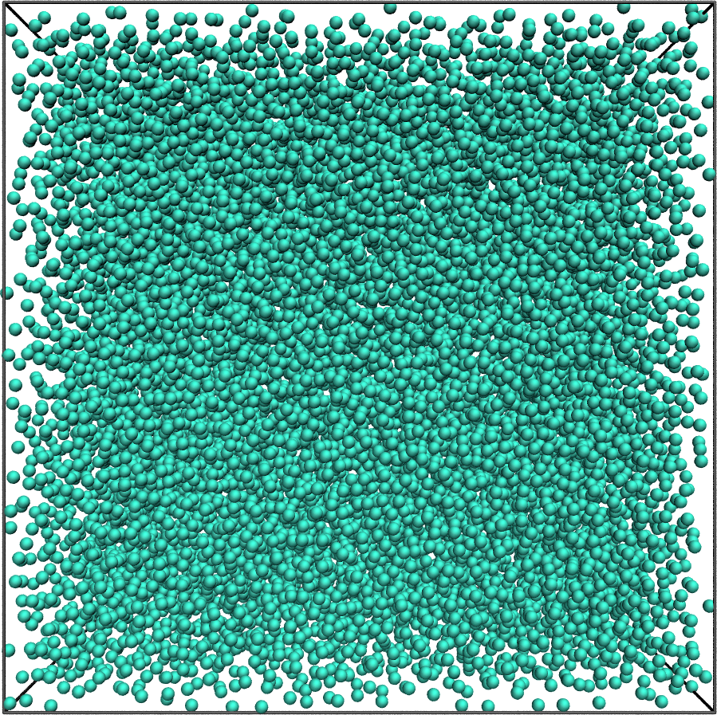

Data file for NMRDfromMD
========================

<a href="webp">
  
</a>

LAMMPS input files and raw trajectory files used to generate the data
and figure from [nmrformd](https://nmrdfrommd.readthedocs.io). The system
consists of a bulk Lennards-Jones fluid.

## Repository Structure

- **[inputs](inputs)**: Contains the LAMMPS input files.
- **[data](data)**: Contains simulation trajectory files (`.xtc` and `.lammpstrj`)
  for various temperatures, generated from the input files.

## Downloading Trajectories

Trajectory files (`.xtc` and `.lammpstrj`) are stored using Git Large File
Storage (LFS). To properly clone the repository and retrieve the large files, run:

```bash
git clone https://github.com/NMRDfromMD/dataset-LJ-fluid.git
cd dataset-LJ-fluid
git lfs pull
```